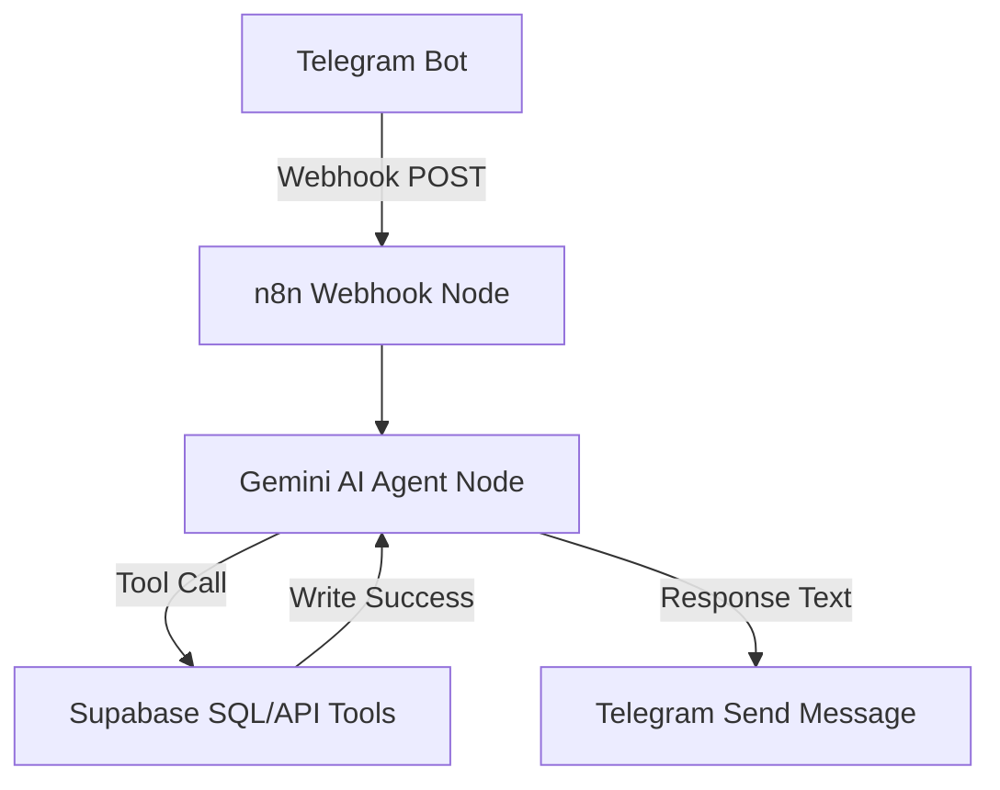

# n8n & Gemini Logic Orchestration Design

This directory contains the orchestration configuration for ARLO. The orchestration engine acts as the "brain stem" routing Telegram messages, running reasoning models via Gemini, and writing states to Supabase.

## Workflow Overview



---

## Step-by-Step Node Design

### 1. Telegram Webhook Trigger
* **Node Type**: `Webhook`
* **HTTP Method**: `POST`
* **Path**: `/telegram-va-webhook`
* **Description**: Listens for payloads sent by the Telegram Bot API when the user texts the bot.
* **Key Expressions**:
  * Message Text: `{{ $json.body.message.text }}`
  * Chat ID: `{{ $json.body.message.chat.id }}`
  * User Telegram ID: `{{ $json.body.message.from.id }}`

### 2. Gemini AI Agent Node
* **Node Type**: `AI Agent` (n8n Advanced AI)
* **Model**: `Google Gemini` (using `gemini-1.5-flash` or `gemini-2.0-flash`)
* **Prompt Type**: `Define System Prompt`
* **System Prompt**:
  ```text
  You are ARLO. Your role is to parse incoming raw messages from the user and manage their Finances, Checklist, and Schedules on Supabase.
  
  Current User Info:
  - User ID: <supabase_user_id>
  - Current Local Time: {{ $now.toString() }}
  
  Understand user intent:
  1. Finances: Identify "Expense" or "Gross Income", amount, category, and description. Call the finance tool.
  2. Checklist: Identify task titles, status, and priorities. Call the checklist tool.
  3. Scheduling: Calculate exact ISO timestamps for events (e.g. tomorrow at 3 PM) and call the schedule tool.
  
  Respond back with a warm, friendly confirmation of the exact operation completed.
  ```

### 3. Declarative Tools (Connected to AI Agent)

#### A. Tool: Log Finance
* **Description**: Insert financial records (expenses and income) into Supabase.
* **n8n Helper**: `HTTP Request` or `Postgres Node`
* **Arguments (JSON Schema)**:
  ```json
  {
    "type": "object",
    "properties": {
      "type": { "type": "string", "enum": ["Expense", "Gross Income"] },
      "amount": { "type": "number" },
      "category": { "type": "string" },
      "description": { "type": "string" }
    },
    "required": ["type", "amount", "category"]
  }
  ```

#### B. Tool: Manage Checklist
* **Description**: Create new tasks or check off existing checklist items.
* **Arguments (JSON Schema)**:
  ```json
  {
    "type": "object",
    "properties": {
      "title": { "type": "string" },
      "priority": { "type": "string", "enum": ["Low", "Medium", "High"] },
      "due_date": { "type": "string", "description": "ISO Timestamp" }
    },
    "required": ["title"]
  }
  ```

#### C. Tool: Time Block Schedule
* **Description**: Create calendar blocks and timelines.
* **Arguments (JSON Schema)**:
  ```json
  {
    "type": "object",
    "properties": {
      "title": { "type": "string" },
      "description": { "type": "string" },
      "start_time": { "type": "string", "description": "ISO Timestamp" },
      "end_time": { "type": "string", "description": "ISO Timestamp" }
    },
    "required": ["title", "start_time", "end_time"]
  }
  ```

### 4. Telegram Responder
* **Node Type**: `Telegram`
* **Operation**: `sendMessage`
* **Chat ID**: `{{ $('Webhook').item.json.body.message.chat.id }}`
* **Text**: `{{ $json.output }}` (Returns the exact conversational response computed by Gemini).

---

## 5. Local Execution via Ollama (Optional)

The workflow includes an **Ollama** node to support self-hosted, local LLMs (e.g., `llama3`, `mistral`, or `qwen`).
* **Requirements**: Install and run Ollama on your local server. Pull your preferred model (e.g., `ollama run llama3`).
* **Connection**: In the n8n editor, connect the **Ollama** chat model node instead of the **Google Gemini** model to the **AI Language Model** input socket of the **Gemini AI Agent** node.
* **Base URL**: Set to `http://localhost:11434` (or `http://host.docker.internal:11434` if n8n is running inside a local Docker container).

